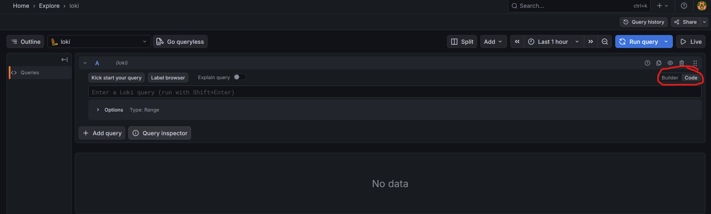

# AWS Cisco Logging Dashboard — Grafana Setup (UI + Data Sources + Dashboards)

This guide assumes your EC2 instance is running the Docker stack:
- Grafana (port 3000)
- Loki (port 3100)
- Promtail (tails `/var/log/cisco-lab.log` and `/var/log/snmptraps.log`)
- Prometheus (scrapes Promtail metrics)

---

## 1) Open Grafana in the AWS Security Group
Ensure your EC2 Security Group inbound rules include:
- **TCP 3000** from your public IP `/32` (recommended)

Then open in your browser:

```text
http://<EC2_PUBLIC_IP>:3000
```

Login:
- Username: `admin`
- Password: `ChangeMe123` (unless you changed `GF_SECURITY_ADMIN_PASSWORD`)


---

## 2) Add Loki as a data source (for logs)
In Grafana:
1. Left menu → **Connections** (or **Data sources**)
2. **Add data source**
3. Select **Loki**
4. URL: `http://loki:3100`
5. **Save & test**

---

## 3) Add Prometheus as a data source (for uptime % metrics)
In Grafana:
1. **Add data source**
2. Select **Prometheus**
3. URL: `http://prometheus:9090`
4. **Save & test**

---

## 4) Verify logs in Explore (Loki queries)

Grafana → **Explore** → choose **Loki**.

Be sure to select "code" rather then builder (Red Circle)



### A) Cisco syslog (all)
```logql
{job="cisco-syslog"}
```

### B) Interface up/down events
```logql
{job="cisco-syslog"} |= "changed state to"
```

### C) SNMP traps (if enabled)
```logql
{job="snmp-traps"}
```

### D) Combined view (syslog + traps)
```logql
{job=~"cisco-syslog|snmp-traps"}
```

---

## 5) Create dashboards

### 5.1 Dashboard: “Cisco Syslog” (log panel)
1. Dashboards → **New** → **New dashboard**
2. **Add visualization**
3. Data source: **Loki**
4. Query:
   ```logql
   {job="cisco-syslog"}
   ```
5. Visualization: **Logs**
6. Save dashboard: `Cisco Syslog`

### 5.2 Dashboard: “SNMP Traps” (log panel)
1. Add another visualization (or a new dashboard)
2. Data source: **Loki**
3. Query:
   ```logql
   {job="snmp-traps"}
   ```
4. Visualization: **Logs**
5. Save dashboard: `SNMP Traps`

---

## 6) Port “uptime percentage” panels (Prometheus / PromQL)

Your Promtail pipeline emits a gauge:

- `cisco_interface_up{device="<HOSTNAME>", iface="<INTERFACE>"}`
  - value `1` means “up”
  - value `0` means “down”

Prometheus stores this over time; uptime % is computed by averaging 0/1 across the time window.

### 6.1 Uptime % for one device + interface (Stat panel)
1. Dashboards → open a dashboard → **Add visualization**
2. Data source: **Prometheus**
3. Query (replace device/iface):
   ```promql
   avg_over_time(cisco_interface_up{device="R1", iface="GigabitEthernet0/1"}[$__range]) * 100
   ```
4. Set Unit to **Percent (0-100)**
5. Title: `R1 Gi0/1 Uptime %`
6. Save

### 6.2 Uptime % for all ports (Table panel)
1. Add visualization
2. Data source: **Prometheus**
3. Query:
   ```promql
   avg_over_time(cisco_interface_up[$__range]) * 100
   ```
4. Visualization: **Table**
5. In panel options, set display name / legend to show labels (varies by Grafana version), e.g.:
   - `{{device}} {{iface}}`
6. Save

### 6.3 Uptime % by device (aggregate)
This answers “overall port uptime by device” across all interfaces captured:

```promql
avg by (device) (avg_over_time(cisco_interface_up[$__range])) * 100
```

Use as a Stat or Bar Gauge panel.

---

## 7) Tips for multiple devices with similar interface names
- Ensure each device has a unique hostname:
  ```text
  hostname R1
  logging origin-id hostname
  ```
- Confirm syslog lines include the hostname. If they do not, the Promtail regex must be adjusted so `device` is extracted correctly.

---

## 8) Troubleshooting quick hits

### 8.1 “Grafana failed to load application files”
Confirm `GF_SERVER_ROOT_URL` and `GF_SERVER_DOMAIN` match exactly how you access Grafana:
- `http://<EC2_PUBLIC_IP>:3000/`

Restart the stack:

```bash
cd ~/log-ui
docker compose restart grafana
```

Hard refresh your browser (Ctrl+F5).

### 8.2 No syslog in Grafana
- Check EC2 file:
  ```bash
  sudo tail -n 50 /var/log/cisco-lab.log
  ```
- Check promtail logs:
  ```bash
  docker logs log-ui-promtail-1 | tail -n 50
  ```

### 8.3 Uptime panels show “no data”
- Generate at least one interface up/down event so the metric exists.
- Confirm Prometheus is scraping Promtail:
  - In Grafana Explore (Prometheus), query:
    ```promql
    up
    ```
  - You should see `promtail` and `prometheus` targets up.

If needed, verify directly from EC2:

```bash
curl -s http://127.0.0.1:9080/metrics | grep -i cisco_interface_up | head
```
